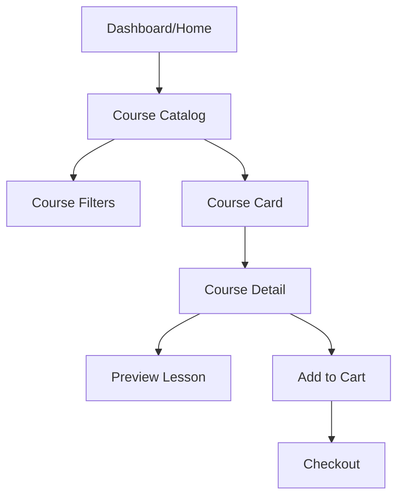
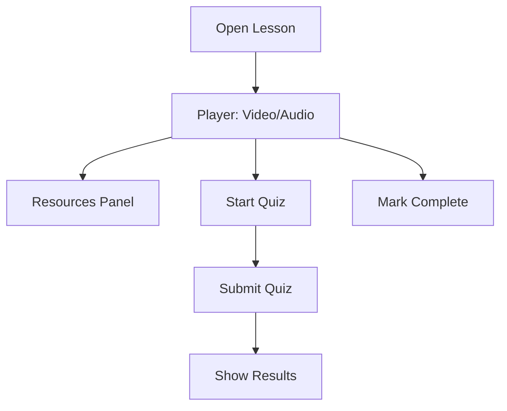
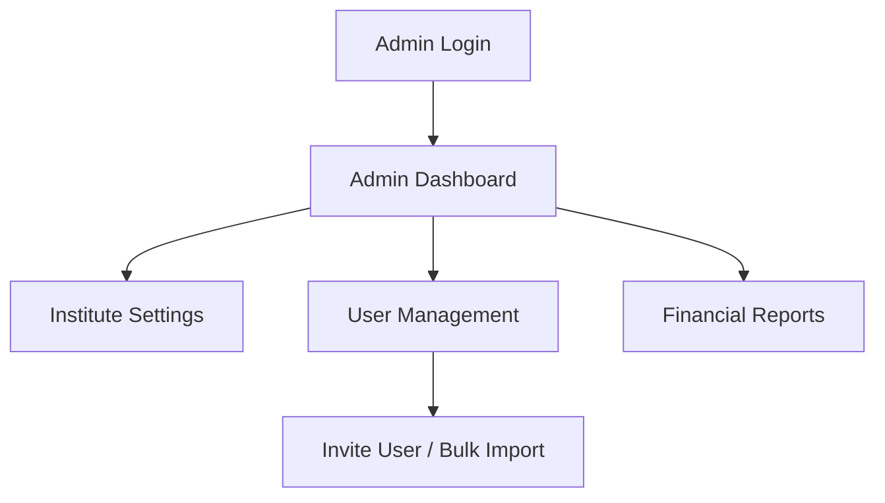

# Cognify — Front-end Specification v1.0

This document translates the `docs/designspec.md` design system into a practical front-end specification for implementation: user flows, wireframes, component contracts, design tokens, accessibility requirements, and technical integration guidance.

Date: 2025-10-28
Version: 1.0

---

## Overview & Goals

- Align UI implementation with the Cognify Design System (colors, typography, spacing).
- Deliver responsive, accessible Blade-based UI components with lightweight interactivity (Alpine.js).
- Provide component contracts and example templates so developers can implement consistent UI rapidly.
- Define user flows and wireframes for core journeys: Dashboard, Course Discovery, Enrollment & Checkout, Lesson Playback, Assessments, and Admin workflows.

---

## Checklist (requirements coverage)

1. Create UI tokens (colors, typography, spacing) as CSS variables / Tailwind config.  
2. Define component library as Blade components with documented props/events.  
3. Provide user flows + mermaid wireframes for 6 core journeys.  
4. Accessibility and performance guidelines.  
5. Build & test requirements (npm scripts, E2E plan).

---

## Design Tokens (implementation-ready)

Prefer two parallel delivery methods: (A) Tailwind CSS config with theme extension, and (B) CSS variables for non-Tailwind assets.

Colors (CSS variables)
```css
:root{
  --cognify-gradient-from: #F23A8E;
  --cognify-gradient-to: #FF7E3E;
  --cognify-primary: #FF4D8D;
  --text-primary: #1B1B1B;
  --text-secondary: #6C6C6C;
  --surface: #FFFFFF;
  --surface-alt: #F9FAFB;
  --border: #E6E8EB;
  --success: #22C55E;
  --warning: #FACC15;
  --error: #EF4444;
  --focus: #3B82F6;
}

/* Example gradient */
.cognify-gradient{background:linear-gradient(90deg,var(--cognify-gradient-from),var(--cognify-gradient-to));}
```

Typography (Tailwind + CSS fallback)
- Base font: Inter (variable) — weights 400, 500, 600, 700
- Display: Poppins for headings (optional)

Tailwind config snippet (conceptual)
```js
// tailwind.config.js
module.exports = {
  theme: {
    extend: {
      colors: {
        cognify: {
          primary: '#FF4D8D',
          'gradient-from': '#F23A8E',
          'gradient-to': '#FF7E3E',
          surface: '#FFFFFF',
          'surface-alt': '#F9FAFB',
        }
      },
      borderRadius: { lg: '12px' }
    }
  }
}
```

Spacing scale (px): 4,8,12,16,20,24,32,40,48,64 — use variables in components.

---

## Component Library (Blade + Alpine.js)

Implementation approach: create reusable Laravel Blade components under `resources/views/components/` and publish a `cognify-ui` partial library. Keep components stateless where possible and use Alpine for local interactivity.

Each component doc below lists: purpose, props, events, markup notes, accessibility notes.

### 1) Button <x-button>
- Purpose: primary action with gradient support
- Props: type (primary|secondary|ghost), size (sm|md|lg), disabled (bool), icon (optional)
- Events: emits click normally
- Markup: use `<button>` with focus-visible outline `--focus`
- Accessibility: provide `aria-pressed` when toggle; respect disabled attribute

Usage example:
```blade
<x-button type="primary" size="md">Enroll Now</x-button>
```

### 2) Sidebar <x-sidebar>
- Purpose: primary navigation for dashboard
- Props: items (array of {key, label, icon, href, active}), collapsed(bool)
- Events: toggle-collapse
- Notes: active item shows left 2px gradient indicator; icons from Lucide

### 3) Topbar <x-topbar>
- Purpose: search, notifications, quick actions
- Props: user (object), showSearch (bool)
- Notes: search should use debounce (300ms) and call `/api/search?q=` for suggestions

### 4) Card <x-card>
- Purpose: generic content container
- Props: title, subtitle, icon, footer
- States: hover elevation (translateY -1px, box-shadow)

### 5) ProgressBar <x-progress>
- Props: value (0-100), color (success|brand|warning|error)
- Visuals: rounded with gradient fill for brand

### 6) CourseList / CourseCard
- Props: course object (id, title, thumbnail, price, rating, tags, short_desc)
- Actions: view details, add to cart, enroll

### 7) Calendar / Schedule component
- Props: events[], date
- Notes: accessible grid, keyboard navigation, aria-live for focus changes

### 8) Modal <x-modal>
- Props: title, size, open:boolean
- Events: close
- Accessibility: focus trap, restore focus on close, `role="dialog" aria-modal="true"`

### 9) Notifications / Toasts
- Usage: non-blocking toasts for success/error with dismiss and optional undo

### 10) Grades Widget
- Props: score, max, colorThresholds
- Visual: circular radial progress with accessible numeric label

Full set should be implemented incrementally with Storybook or a simple component gallery page at `/docs/ui-components`.

---

## Core User Flows & Wireframes

I'll provide 6 prioritized user flows with mermaid diagrams and simple wireframe sketches (ASCII + description) to guide implementation.

### Flow 1: Student Dashboard (Primary landing)
- Goals: quick glance at ongoing lessons, upcoming schedule, recent messages, progress

Mermaid flow:
```mermaid
graph TD
  A[Login] --> B[Dashboard]
  B --> C[Ongoing Lesson Panel]
  B --> D[Upcoming Schedule]
  B --> E[Recent Assignments]
  B --> F[Quick Actions (Join Live, Resume Course)]
  C --> G[Open Lesson Player]
  E --> H[Open Assignment]
```

Wireframe (top-to-bottom):
- Topbar (search, notifications)  
- Left Sidebar (nav)  
- Main columns: 1) Ongoing Lesson (card) 2) Schedule (calendar) 3) Progress & Notices (cards)

Acceptance criteria:
- Widgets load within 1s with cached data; keyboard accessible; mobile layout stacks vertically.

### Flow 2: Course Discovery & Detail
- Goals: browse, filter, view course details, preview, add to cart

Mermaid flow:


Wireframe notes:
- Catalog: grid of `CourseCard` with thumbnail, rating, price tag (prominent)
- Filters: categories, level, price, language
- Course detail: hero with gradient CTA, syllabus, instructor card, reviews, related courses

### Flow 3: Enrollment & Checkout
- Goals: complete purchase, choose payment method, receive confirmation

Mermaid flow:
```mermaid
graph TD
  A[Course Detail] --> B[Cart]
  B --> C[Checkout (Shipping/Billing optional)]
  C --> D[Payment Gateway Selection]
  D --> E[Payment Processing]
  E --> F[Webhook Confirmation]
  F --> G[Enrollment Complete]
```

Notes:
- Use server-side checkout with tokenization. Support Stripe & Razorpay. Webhooks must be idempotent and reflected in UI with polling until confirmation.
- Keep payment form in secure iframe or use gateway-hosted flows.

### Flow 4: Lesson Playback & Interaction
- Goals: play video, track progress, open resources, take quick quiz

Mermaid flow:


Player Requirements:
- Persistent playback position saved to server every 15s; captions; playback speed control; keyboard shortcuts (space play/pause, arrows seek)

### Flow 5: Assessment & Grading
- Goals: take timed tests, autosave answers, submit and view feedback

Mermaid flow:
```mermaid
graph TD
  A[Open Test] --> B[Instructions]
  B --> C[Attempt (autosave every 10s)]
  C --> D[Submit] --> E[Auto-grading / Manual grading]
  E --> F[View Results & Feedback]
```

Requirements:
- Autosave mechanism, offline resilience (save to localStorage then sync), clear timer UI with accessible labels

### Flow 6: Institute Admin - User & Settings
- Goals: manage users, configure institute settings, view financials

Mermaid flow:


Wireframe notes:
- Left nav includes Users, Settings, Billing, Analytics. Main area shows lists with filters, action dropdowns, and modals for create/edit.

---

## Accessibility Requirements

- All interactive elements must be keyboard accessible and have visible focus styles (use `--focus` color).  
- Contrast: ensure 4.5:1 for body text, 3:1 for large text.  
- Screen reader: use semantic HTML and ARIA roles for custom controls (`role=dialog`, `aria-live` for notifications).  
- Forms: descriptive error messages and ARIA `aria-invalid` states.  
- Motion: respect `prefers-reduced-motion` for all animations.

---

## Performance & Progressive Enhancement

- Lazy load images and video thumbnails.  
- Use server-side rendered Blade pages for first paint; hydrate interactive pieces with Alpine.js.  
- Use HTTP caching for catalog endpoints and SWR (stale-while-revalidate) pattern for dashboard widgets.  
- Bundle size target: keep main JS < 150KB gzipped for mobile-pwa.

---

## Technical Integration & API Contracts (frontend perspective)

Authentication
- Use Laravel Sanctum for SPA token authentication. Login via `/login` that returns session cookie + csrf.

Key endpoints (examples)
- GET /api/dashboard -> { widgets }
- GET /api/courses?query=&filters= -> { items: [], meta }
- GET /api/courses/{id} -> { course }
- POST /api/cart -> { cart }
- POST /api/checkout -> { paymentIntent }
- POST /api/webhooks/{gateway} -> (webhook handler)
- GET /api/lessons/{id}/progress -> { position }
- POST /api/lessons/{id}/progress -> { saved }

Error handling
- Show user-friendly messages for 4xx and 5xx; implement retry for non-critical background sync (exponential backoff).

Security
- Never persist raw payment data in frontend storage. Use tokens. Sanitize all inputs.

---

## Testing Strategy

1. Unit tests: Blade component snapshot tests (Pest or PHPUnit), Alpine behavior unit tests where possible.  
2. Integration: Laravel Dusk for core flows (login, enroll, lesson playback).  
3. Accessibility: axe-core CI checks on major pages.  
4. Performance: Lighthouse CI for home/dashboard and checkout.

CI hooks
- Run linting (eslint/stylelint), run axe accessibility suite, run PHP unit tests, and run Dusk smoke tests for critical flows.

---

## Developer Onboarding & Implementation Notes

- Starter tasks:
  1. Add design tokens to `tailwind.config.js` and create `resources/css/_tokens.css` with CSS variables.
  2. Scaffold `resources/views/components` with Button, Card, Sidebar, Topbar, Modal, Progress components.
  3. Create `routes/web.php` pages: `/dashboard`, `/courses`, `/courses/{id}`, `/lesson/{id}` and protect with middleware.
  4. Add `resources/js/app.js` to initialize Alpine and optional plugins (debounce). Build with Vite or Mix depending on project setup.

Commands (example)
```bash
composer install
npm install
npm run dev    # local
npm run build  # prod
```

---

## Deliverables & Milestones

1. Design tokens and Tailwind variables — 1 day
2. Core Blade components + component gallery — 3 days
3. Dashboard, Catalog, Course Detail pages — 4 days
4. Enrollment & Checkout flow with payment integration stubs — 3 days
5. Lesson Player and Assessment basics — 4 days
6. Admin pages and user management — 3 days

Total MVP front-end implementation estimate: 2–3 sprints (team of 2 front-end devs).

---

If you want, I can now:
- scaffold the `resources/views/components` files and a component gallery page, or
- generate Mermaid PNG wireframes for each flow, or
- produce a Storybook-ready component index.

Select one of the above or tell me which deliverable to produce next.
